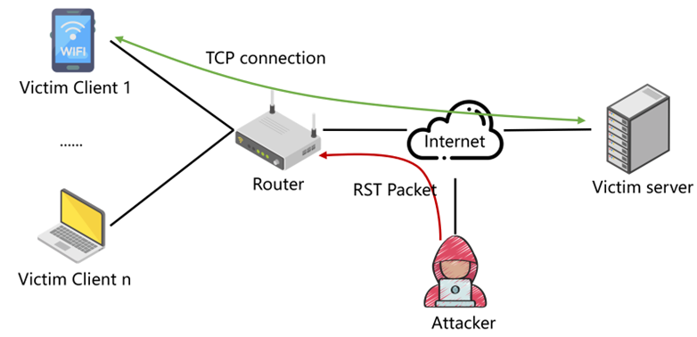
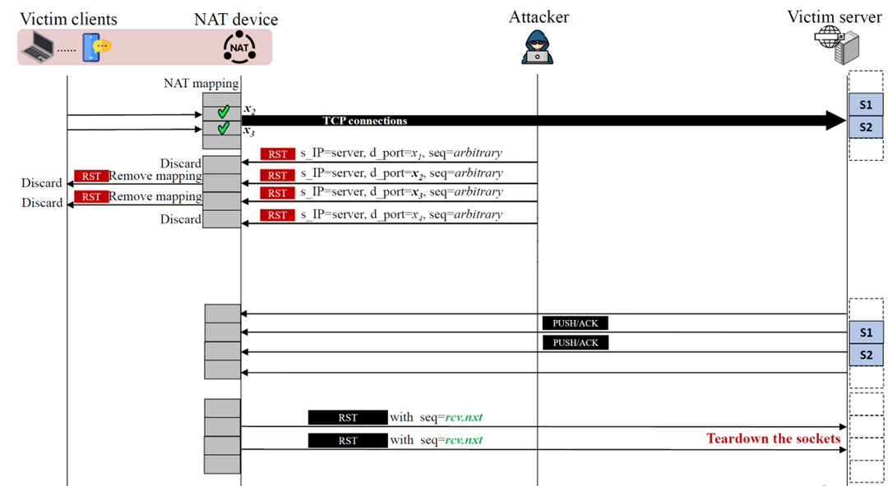
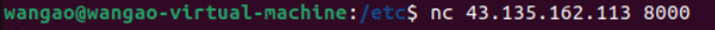
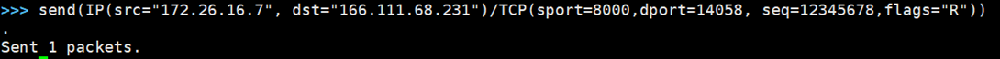
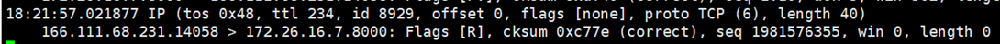
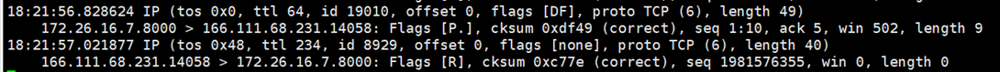

# Remote TCP DoS Vulnerability in MERCURY A12G Router

## Description

When using the MERCURY A12G router as a NAT device, an attacker can send spoofed RST messages remotely to clear the port mapping stored in the device, leading to communication interruptions.

## Threat Model

The victim client uses the MERCURY A12G router as a NAT device to connect to the remote victim server and access online services via TCP. The MERCURY A12G router maps the client's local private IP address to a public IP address to access servers on the public network.

An off-path attacker on the Internet aims to sever the TCP connection between the client and the server, conducting a DoS attack. The off-path attacker is capable of sending packets with spoofed source IP addresses. Currently, about one-fourth of the AS on the Internet do not filter spoofed source address packets leaving their network, making it possible for attackers to rent machines with the capability of source address spoofing to conduct network attacks.

## Step

Initially, the victim client establishes a TCP connection to the victim server, and the parameters of the TCP connection (such as the source port number and sequence number) cannot be observed by the off-path attacker.

The attacker impersonates the victim server, spoofing multiple TCP RST packets, and sends them to the public IP address of the MERCURY A12G router. The source IP address of the forged RST packets is set to the IP address of the victim server. The destination port number (dport), which is the source port number of the TCP connection initiated by the client, is usually within a small range, such as 32768 to 61000 on Linux-based systems. The source port number (i.e., the destination port of the TCP connection) is typically known, such as port 80 for HTTP. The sequence number of the forged RST packets is arbitrary and does not require an acknowledgment number. 

The forged TCP RST packets with the correct dport will cause the MERCURY A12G router to clear the session mapping with the remote server.

Subsequently, packets from the server (PUSH/ACK) will not be able to reach the victim client through the MERCURY A12G router, and the MERCURY A12G router will return an RST packet with the correct sequence number, causing the server-side socket to be closed.

##   Experimental Process and Results

The victim client's local IP address is 192.168.70.132, the MERCURY A12G router's public IP address is 166.111.68.231, and the victim server's public IP address is 43.135.162.113, with an internal IP address of 172.26.16.7. The off-path attacker's objective is to conduct a DoS attack, causing TCP packets from the target server to the victim client to be lost. 

(1) The client connects to the server using the nc command

(2) The attacker impersonates the server and sends forged RST packets to the public IP address of the MERCURY A12G router. (Since source address spoofing can impact the Internet environment, in the actual test, we chose to have the victim server send packets with incorrect sequence numbers using scapy.)

(3) The MERCURY A12G accepts the RST packets, simultaneously deleting the corresponding session mapping from its cache.

(4) When the server attempts to communicate normally and sends data to the victim client, the server will receive an RST packet from the TPMERCURY A12G router, and the server-side connection will be disconnected.

